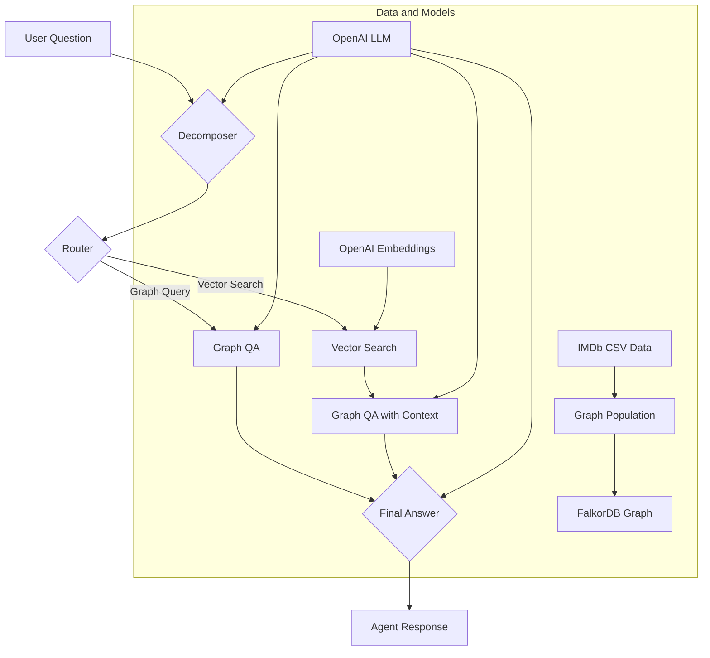

# Project Architecture

This project implements a Graph-based Retrieval-Augmented Generation (GraphRAG) pipeline using FalkorDB, LangChain, and LangGraph. The system is designed to answer questions about a movie dataset by leveraging both a knowledge graph and vector search.

## Core Components

- **Data Source:** A CSV file (`data/imdb_top_1000.csv`) containing information about the top 1000 movies from IMDb.
- **Graph Database:** FalkorDB is used to store the movie data as a knowledge graph. The graph consists of `Movie`, `Person`, and `Genre` nodes, connected by `DIRECTED`, `ACTED_IN`, and `IN_GENRE` relationships.
- **LLM and Embeddings:** The project uses OpenAI's GPT-4o model for language understanding and generation, and OpenAI's embeddings for creating vector representations of movie overviews.
- **RAG Pipeline:** LangGraph is used to define and orchestrate the RAG pipeline as a stateful graph. The pipeline can route questions to either a graph query engine or a vector search engine based on the question's content.
- **Environment Orchestration:** Docker and `docker-compose.yml` are used to set up and run the FalkorDB database instance, providing a consistent and reproducible environment.

## Architectural Diagram (Mermaid)

## Detailed Workflow

### 1. Data Ingestion and Graph Construction

The pipeline starts by loading data from the `imdb_top_1000.csv` file. The data is cleaned and then transformed into a graph structure within FalkorDB. The graph schema is as follows:

-   **Nodes:**
    -   `Movie`: Represents a movie. Properties include `title`, `overview`, `year`, and `embedding`.
    -   `Person`: Represents a person (an actor or director). Properties include `name`.
    -   `Genre`: Represents a movie genre. Properties include `name`.
-   **Relationships:**
    -   `[:DIRECTED]`: Connects a `Person` to a `Movie` they directed.
    -   `[:ACTED_IN]`: Connects a `Person` to a `Movie` they acted in.
    -   `[:IN_GENRE]`: Connects a `Movie` to its `Genre`.

In addition to the graph structure, a vector index is created on the `embedding` property of the `Movie` nodes. This allows for efficient similarity searches on movie overviews.

### 2. The RAG Pipeline (LangGraph)

The core of the question-answering system is a stateful graph built with LangGraph. This graph, represented by `GraphState`, manages the flow of information as a question is processed. The `GraphState` includes the original question, any generated sub-questions, retrieved documents (context), and the final answer.

The pipeline consists of the following nodes:

-   **`decomposer`:** Takes a complex user question and breaks it down into simpler, answerable sub-questions using an LLM.
-   **`router`:** A conditional routing node that decides the next step based on the content of the question. It directs the question to either `graph_qa` for structured queries (e.g., "who directed this movie?") or `vector_search` for semantic queries (e.g., "movies about space travel").
-   **`graph_qa`:** This node is responsible for answering questions using the knowledge graph. It uses an LLM to generate a Cypher query from the user's question, executes the query on FalkorDB, and returns the result.
-   **`vector_search`:** This node handles semantic search. It embeds the user's question into a vector and uses FalkorDB's vector search capabilities to find movies with the most similar overviews.
-   **`graph_qa_with_context`:** This node combines the results from the vector search with the power of graph queries. It uses the context from the `vector_search` to inform the generation of a more accurate and context-aware final answer.
-   **`final_answer`:** This node synthesizes all the information gathered by the previous nodes to generate a comprehensive, human-readable answer.

### 3. Query Execution Paths

A user's question can take one of two main paths through the LangGraph:

-   **Graph Query Path:**
    1.  The question is identified as a structured query by the `router`.
    2.  The `graph_qa` node generates and executes a Cypher query.
    3.  The results are passed to the `final_answer` node.
-   **Vector Search Path:**
    1.  The question is identified as a semantic query by the `router`.
    2.  The `vector_search` node finds relevant movies based on overview similarity.
    3.  The retrieved movie information is passed as context to the `graph_qa_with_context` node.
    4.  The `graph_qa_with_context` node uses this context to generate a more informed answer.
    5.  The result is passed to the `final_answer` node.
